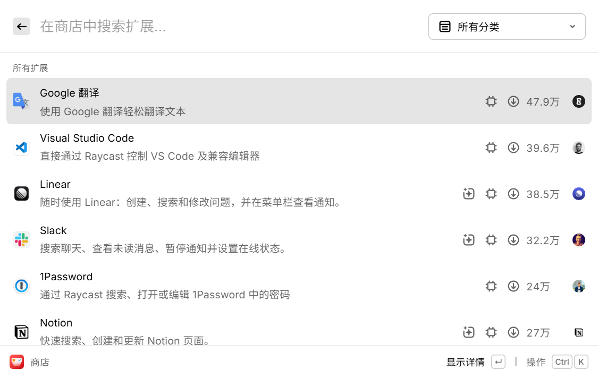
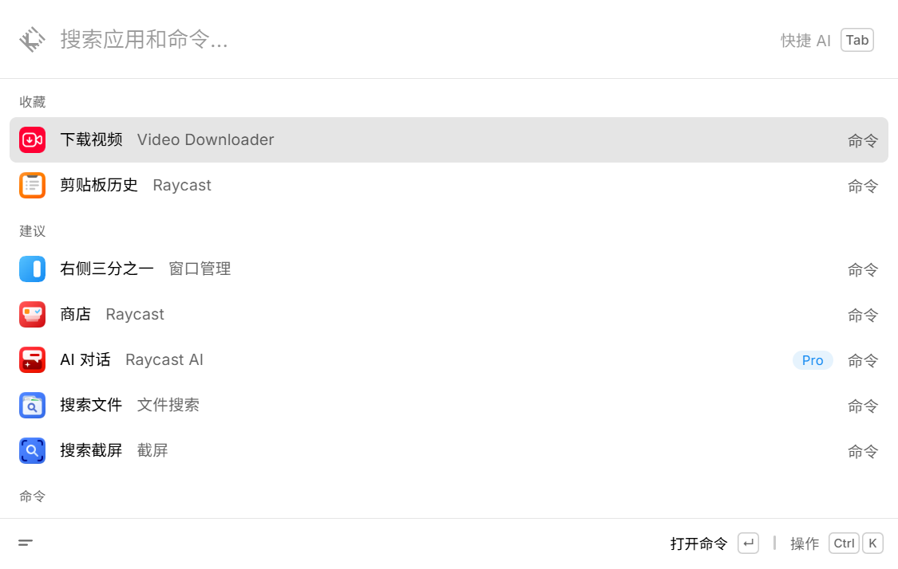

# Raycast Windows 汉化｜简体中文界面与插件汉化包

适配 Microsoft Store 版 **Raycast 2.4.0.0 x64**，非官方项目。

Raycast Windows Simplified Chinese Localization：为 Raycast 主界面、设置、托盘菜单与热门插件提供中文显示，附安装和卸载恢复工具。

## 选择你的平台

| 平台 | 项目与安装说明 | 汉化包下载 |
| --- | --- | --- |
| Windows · 2.4.0.0 x64 | [Raycast Windows 汉化](https://github.com/zwjtano/raycast-windows-zh-CN) | [Windows 下载](https://github.com/zwjtano/raycast-windows-zh-CN/releases) |
| macOS · 2.4.1.0 Apple Silicon | [Raycast macOS 汉化](https://github.com/zwjtano/raycast-macos-zh-CN) | [macOS 下载](https://github.com/zwjtano/raycast-macos-zh-CN/releases/latest) |

[下载 Windows 汉化包](https://github.com/zwjtano/raycast-windows-zh-CN/releases/tag/v2.4.0.0-r2) · [100 个插件清单与检查结果](docs/extensions.md) · [macOS 独立项目](https://github.com/zwjtano/raycast-macos-zh-CN)

## 使用

1. 完整解压 Windows ZIP。
2. 保存正在编辑的内容；首次安装前从 Raycast 托盘菜单选择 **Quit**，然后双击 `安装汉化.cmd`。
3. 以后通过桌面或开始菜单的 **Raycast（简体中文）** 启动。正在运行时，原有热键仍然可用。
4. 双击 `卸载汉化.cmd`，或在 Windows“已安装的应用”中卸载“Raycast 简体中文组件”。卸载会退出 Raycast 并重新打开原版。

无需额外安装 Node、Python 或开发工具；运行时使用 Raycast 自带的 Node。默认不添加开机启动。

**通过原版入口独立启动时不会加载主界面和托盘中文。** 这是独立汉化组件，不是商店扩展。已修改的插件显示文件在卸载组件前仍保留中文。Raycast 更新到其他版本后，此组件会拒绝加载，需要等待对应汉化包。更新组件前请先卸载旧版。

## 原理与边界

Windows 安装包启用了内容完整性校验。本组件不写入 WindowsApps，不修改 Raycast 官方可执行文件、资源、数据库或账户数据。主界面和托盘的内存修改随进程退出而消失。

插件在用户扩展目录中处理：只修改语法分析确认的显示字符串，修改前保存完整备份与 SHA-256。卸载按校验恢复；遇到插件更新则保留新版，遇到汉化后手动修改则保留备份并报告冲突。命令 ID、请求参数、密码、用户输入和动态变量不作为替换目标。

汉化启动器为这次 Raycast 进程设置 WebView2 参数，通过随机的本机回环端口加载中文显示资源。组件运行期间，本机调试接口可以访问 Raycast WebView；不要在不可信的共享电脑上使用。退出 Raycast 或卸载并重启原版后，该接口关闭。参数不写入全局环境或系统策略。

基础词典来源于独立 macOS r4 项目，另补充 Windows 与热门插件用语。构建工具通过 JavaScript AST 替换显示字段；运行时用精确词典补充按钮、菜单、标签和占位文字。不会将文本发送到在线翻译服务。

原生托盘菜单通过单独的 .NET 启动模块翻译，覆盖“打开 Raycast”“使用手册”“故障排查”“设置”“退出”等深色、浅色菜单。模块仅随中文启动器加载，退出进程即移除内存修改。

插件名单覆盖 **2026-09-18 Windows 热门榜第 1–10 页的 100 个插件**。检查过 2,876 个上游源码文件，支持已匹配的命令标题、偏好设置标签、表单、菜单、通知和确认提示。用户需自行从 Store 安装插件；组件不会批量安装它们。运行期间每 15 秒检查名单内的已安装插件，必要时返回主界面再进入插件以刷新显示。

**源码检查不等于逐页实测。** 本机验收包含主界面、设置、Video Downloader 初始表单和托盘模块状态。登录后、付费、外部设备及第三方服务页面未逐个验收。动态拼接文字、自定义组件、服务返回内容及未命中的说明仍可能保留英文。AI 回复、代码、输入框值、可编辑正文不作为动态替换目标。插件仅限 macOS 的子功能不会因汉化获得 Windows 支持。

r2 补充商店列表和详情页的显示转换，包含上述 100 个插件的介绍译文；商品名与品牌名按原名保留，Google Translate 显示为“Google 翻译”。已在本机确认商店列表中的 Google 翻译、VS Code、Linear、Slack、1Password 和 Notion 介绍显示中文。

译文条目数、静态替换数量不等于实测页面覆盖率。实际验证范围请参阅 Release 说明。

## 状态和故障处理

双击 `检查状态.cmd`。状态与错误日志位于 `%LOCALAPPDATA%\Raycast-zh-CN\runtime`。插件结果在 `plugin-status.json`，备份在 `plugin-backups`。

如启动未显示中文，先退出 Raycast，然后使用中文快捷方式重新启动。若遇指纹不匹配，不要修改校验文件。卸载后使用官方原版即可。

安装文件位于 `%LOCALAPPDATA%\Raycast-zh-CN`；原生菜单模块位于 `%LOCALAPPDATA%\Packages\Raycast.Raycast_qypenmj9wpt2a\LocalState\Raycast-zh-CN`（用户数据目录，不是官方安装目录）。卸载会清理这两处由组件创建的文件。只删除安装清单记录的文件和本组件创建的快捷方式，保留用户自行放入的额外文件。

## 开发

在仓库根目录执行 `npm ci`、`npm test`、`npm run build`、`npm run package`。构建需要本机安装适配的官方 Raycast；不会将官方程序打包进安装 ZIP。

榜单快照：`python tools/snapshot-store.py`；平台审计：`python tools/audit-extensions.py`；源码快照：`python tools/fetch-extension-components.py`；显示字段检查：`node tools/audit-plugin-sources.mjs`。审计使用公开源码与 `gh`，不执行插件业务逻辑。来源与许可见 [第三方说明](THIRD-PARTY-NOTICES.md)。

WebView2 调试参数：[Microsoft 文档](https://learn.microsoft.com/en-us/microsoft-edge/webview2/how-to/debug-visual-studio-code)。
